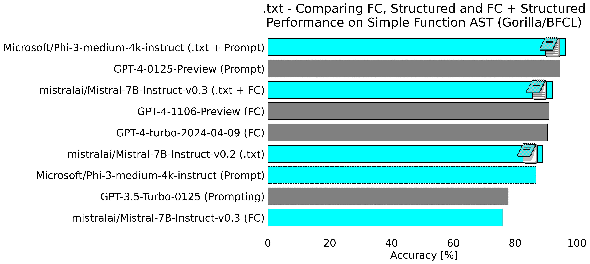

# Structured Generation with the Gorilla/Berkley Function Calling Leaderboard


This fork of the Gorilla/Berkeley Function Call Leaderboard (BFCL) is to reproduce the internal results published by the [.txt](https://dottxt.co/) team showing that structured generation with Outlines can outperform the best GPT-4 models on the `simple` test set for the BFCL.

This repo will allow you to reproduce the result visulized in the figure below:



This README contains detailed instruction for both re-running all of the evaluations from scrath as well as simply exploring the data generated during these evaluations to better understand the results.

## Thanks!

First things first: Open source isn't possible without active and supporting community. This work is no exception. Two major shout outs are in order before we go on:

1. These structured generation evaluations would not have been possible without the existing work of Outlines contributor and active community memeber Alonso Astroza ([@aastroza](https://github.com/aastroza)). Please take a moment to read through his original work on [Outlines Function Calling Evaluation](https://github.com/aastroza/structured-generation-benchmark/blob/main/reports/bfcl_outlines.md).

2. This project is a *fork* of the original "Gorilla: Large Language Model Connected with Massive APIs" to experiment with function calling and structured generation. please see the original [Project Website](https://shishirpatil.github.io/gorilla/) for more detail. Here is the original citation for Gorillia/APIBench

```text
@article{patil2023gorilla,
  title={Gorilla: Large Language Model Connected with Massive APIs},
  author={Shishir G. Patil and Tianjun Zhang and Xin Wang and Joseph E. Gonzalez},
  year={2023},
  journal={arXiv preprint arXiv:2305.15334},
} 
```

## Getting Started

I have included all of the original data generated by these experiments so there is no explicit need to re-run everything in order to *inspect* the results of these runs. If inspecting the results is your main goal, please jump to the [Data section](#Data). 

To reproduce all the results posted you'll need:

- An account with [Modal](https://modal.com/), all of the open models are run through a modal endpoint.

- [OpenAI](https://openai.com/) account with the `OPENAI_API_KEY` environmental variable set. This is required only if you want to evaluate the GPT models.

- [Mistral](https://mistral.ai/) account with the `MISTRAL_API_KEY` environmental variable set. This is required only if you want to evaluate the proprietary Mistral models. (Mistral code coming soon!)

### Install Dependencies

Before generating the leaderboard statistics, you should install dependencies using the following command: 

```bash
    conda create -n BFCL python=3.10
    conda activate BFCL
    pip install -r requirements.txt # Inside ./berkeley-function-call-leaderboard
    pip install vllm # If you have vLLM supported GPU(s) and want to run our evaluation data against self-hosted OSS models.
```
If you plan to evaluate on OSS models, we are using vLLM for inference and refer to https://github.com/vllm-project/vllm for detail. We recommend to inference on at least V100s, A100s, and latest GPUs that are supported by vLLM. 

### Checker Setup (required for Java, JavaScript test categories)

Note: This is from the original repo documentation, and while we will only be using 'simple' test category, you will get annoying errors if you don't follow these steps.

We use `tree-sitter` to do the AST parsing for Java and JavaScript test categories. Thus, you need to install `tree-sitter`.

The git clones need to be under the `/berkeley-function-call-leaderboard/eval_checker` folder.

```bash
cd ./eval_checker
git clone https://github.com/tree-sitter/tree-sitter-java.git
git clone https://github.com/tree-sitter/tree-sitter-javascript.git
```

Now, move back to `/berkeley-function-call-leaderboard` by `cd ..`, and create two symbolic links to the `tree-sitter-java` and `tree-sitter-javascript` directories. This is required to run `openfunctions_evaluation.py`.

```
ln -s eval_checker/tree-sitter-java tree-sitter-java
ln -s eval_checker/tree-sitter-javascript tree-sitter-javascript
```
## Replicating the benchmark

If you would like to rerun all the benchmarks from scratch here's the steps you need to follow:

### Modal

To start with we need to deploy two modal classes. One for doing structured generation on open models and the other for doing unstructured generation (still through Outlines).

The modal files can be found in the `./modal` directory. To deploy these it's best to follow the documentation on [the Modal website](https://modal.com/docs/guide). You may also want to change the configuration in these as you should only need a single GPU (I have multple used from earlier testing with larger models).

NOTE: Modal can take awhile to start up, so if it's stuck at 0% for quite a while that is normal. Additionally running the structured evals will take notably longer because we're recompiling the regex for each function with each run of the evals. In a production environment the regex would be compiled once and after that performance would on par with unstructured generation.

### Remove old results

I've included the results of the runs so that anyone interested in just exploring the data is free to. However if you want to re-run the benchmarks you'll need to remove these first. You can empty them all or simply remove a specific directories. In the `berkeley-funtion-call-leaderboard/result/` directory run the following command to remove an individual model:

```bash
rm -rf phi3-med4k-outlines
```

If existing result data is present when you run the evaluation, it will simply use the existing data rather than re-running everything from scratch.

### Run

To run the evaluations you need to go to the `berkeley-funtion-call-leaderboard` directory and run the following command:

```bash
python ./openfunctions_evaluation.py --model "phi3-med4k-outlines" --test simple
```

You can substitue `phi3-med4k-outlines` for the model of your choice found in `berkeley-function-call-leaderboard/model_handler/handler_map.py`

Reminder: This will be slower for the structured generation examples, only because it has to compile the regex structure into a FSM for each function call. Typically these would be cached and the performance difference would be negligable.

As this model runs if will store the outcome in the `berkeley-function-call-leaderboard/results/<MODEL_NAME>` folder.

### Evaluate

After you have run the model you then need to run the evaluation seperately. To do this go to the the `berkeley-function-call-leaderboard/eval_checker` directory and run the `eval_runner.py` command like so:

```bash
cd eval_checker
python ./openfunctions_evaluation.py --model "phi3-med4k-outlines" --test simple
```

This will display the score the model achieved as well as update data in the `berkeley-function-call-leaderboard/score` folder.

## Data

Now that everything is run we have a bunch of data we can explore to better understand what's happened. I've included all the initial data in this fork so that if you don't have the time or resources to rerun the full experiment you can still have fun exploring the outcomes. The following files/directories in the `/berkeley-function-call-leaderboard/` folder are helpful:

- `data/gorilla_openfunctions_v1_test_simple.json` has the questions the model will be evaluated on.
- `data/possible_answer/gorilla_openfunctions_v1_test_simple.json` has the possible acceptable answers.
- `result/<MODEL_NAME>/gorilla_openfunctions_v1_test_simple_result.json` has answers that were provided by a given model.
- `score/data.csv` has the leader-board results.
- `score/<MODEL_NAME>/simple_score.json` contains details about which questions the model got wrong and why.


In the `notebooks` directory you will also find a `visualize_scores.ipynb` file that will do a simple plot of all the results.

## Error Analysis

I have added a simple simple notebook in `notebooks/error_analysis.ipynb` that serves as a starting point for simply loading the data and exploring the cases where GPT-4 was wrong and Phi-3 + .txt/Outlines was correct. It should be relatively straightfoward to explore on your own with this as a starting point.

There are a couple of interesting things worth pointing out.

For some of the case *Phi-3-medium just performs better than GPT-4*. Here is one such example:

```
Question: Search for upcoming month rock concerts in New York.
-------
GPT-4 answer (incorrect): [event_finder.find_upcoming(location="New York, NY", genre="rock")]
Phi-3 answer (correct): [event_finder.find_upcoming(location="New York, NY", genre="rock", days_ahead=30)]
```

In this case Phi-3 was able to correctly determine that it had to look ahead 30 days, an argument GPT-4 did not use.

There are also some questionable cases. For example:

```
Question: Order three bottles of olive oil and a five pound bag of rice from Safeway in Palo Alto.
-------
GPT-4 answer (correct): [safeway.order(location="Palo Alto", items=["olive oil", "five pound bag of rice"], quantity=[3, 1])]
Phi-3 answer (incorrect): [safeway.order(location='Palo Alto, CA', items=['olive oil', 'rice'], quantity=[3, 1])]
```

Is it really the case that GPT-4 is wrong? You'll find this cuts both ways when you look for cases that Phi-3 got wrong and GPT-4 got correct:

```
Question: What is the change in entropy in Joules per Kelvin of a 1kg ice block at 0°C if it is heated to 100°C under 1 atmosphere of pressure?
-------
GPT-4 answer (correct): [entropy_change.calculate(substance='ice', mass=1, initial_temperature=0, final_temperature=100)]
Phi-3 answer (incorrect): [entropy_change.calculate(substance="water", mass=1, initial_temperature=0, final_temperature=100, pressure=1)]

```

I would argue in this case GPT-4 is wrong and Phi-3 is correct. However we're sticking to the rules in the original benchmark.

Finally one *huge* advantage of structured generation which is worth calling out since some people may claim it is questionable: BCFL is *very* picky about how it wants floats handled. The value `1` is *not* and acceptable float, the result must have a decimal like `1.0`. Here is an example where this comes up:

```
Question: Calculate the average of list of integers [12, 15, 18, 20, 21, 26, 30].
-------
GPT-4 answer (incorrect): [calculate_average(numbers=[12, 15, 18, 20, 21, 26, 30])]
Phi-3 answer (correct): [calculate_average(numbers=[12.0, 15.0, 18.0, 20.0, 21.0, 26.0, 30.0])]
```

Personally I think this is fair (though worth noting Phi-3 would *still* come out ahead if this was not the case) since there are times were very tiny details in format are huge. Maybe this function handles ints differently than floats? Using Structured generation means we can be *very* specific about how we want the format to be.

## I want to try my own thing!

If you want to experiment with your own variation on these experiments you need to follow these basic steps:

- Add or modify a Modal handler in the `berkeley-function-call-leaderboard/model_handler` directory.

- Add a key to your model name and handler to `berkeley-function-call-leaderboard/model_handler/handler_map.py`

- Add metadata information to `berkeley-function-call-leaderboard/eval_checker/eval_runner_helper.py`

After that you should be set to run your modal through the evaluation framework just like any other!

## Keep up to date!

The best places to keep up with what the .txt team is doing is to:

- Subscribe to the [.txt blog](https://blog.dottxt.co/)

- Follow us on [X/Twitter](https://x.com/dottxtai)

- And please *star* and follow the [Outlines github repo](https://github.com/outlines-dev/outlines)
